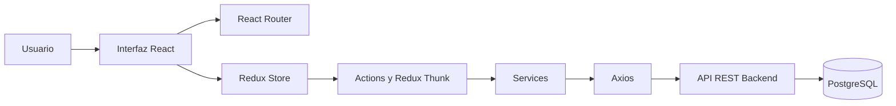

# 🦠 COVID-19 App/Web — Panel de Gestión


Aplicación web desarrollada con **React** para la gestión y el seguimiento de pacientes, médicos, coordinadores y hospitales en el contexto de la pandemia de COVID-19.

El sistema funciona como panel administrativo del proyecto **CroniWeb** y se comunica con una API REST desarrollada con Spring Boot.

---

## 📋 Tabla de contenidos

- [Descripción del proyecto](#-descripción-del-proyecto)
- [Características](#-características)
- [Roles del sistema](#-roles-del-sistema)
- [Tecnologías utilizadas](#️-tecnologías-utilizadas)
- [Arquitectura general](#️-arquitectura-general)
- [Requisitos previos](#-requisitos-previos)
- [Instalación](#-instalación)
- [Variables de entorno](#️-variables-de-entorno)
- [Ejecución](#-ejecución)
- [Compilación para producción](#-compilación-para-producción)
- [Pruebas](#-pruebas)
- [Despliegue](#-despliegue)
- [Estructura del proyecto](#-estructura-del-proyecto)
- [Rutas principales](#-rutas-principales)
- [Integración con el backend](#-integración-con-el-backend)
- [Scripts disponibles](#-scripts-disponibles)
- [Solución de problemas](#-solución-de-problemas)
- [Contribuciones](#-contribuciones)
- [Autores](#-autores)

---

## 📋 Descripción del proyecto

**COVID-19 Web** es una aplicación frontend que proporciona una interfaz para administrar la información generada por el sistema de seguimiento de pacientes.

La aplicación se comunica mediante solicitudes HTTP con una API REST backend y permite realizar tareas administrativas relacionadas con:

- Pacientes.
- Médicos.
- Coordinadores.
- Hospitales.
- Formularios de seguimiento.
- Preguntas y respuestas.
- Asignaciones de pacientes.
- Mensajes.
- Autenticación y recuperación de contraseñas.

El frontend utiliza **React** para construir la interfaz, **Redux** para administrar el estado global, **React Router** para la navegación y **Axios** para comunicarse con el backend.

---

## ✨ Características

### 🔐 Autenticación y seguridad

- Inicio de sesión de usuarios.
- Control de acceso según el rol.
- Almacenamiento de la sesión autenticada.
- Protección de opciones administrativas.
- Cierre de sesión.
- Recuperación de contraseña mediante correo electrónico.
- Restablecimiento de contraseña mediante token.

### 🏥 Gestión de hospitales

- Registro de hospitales.
- Edición de información.
- Listado de hospitales.
- Administración de información geográfica.
- Asignación de médicos a hospitales.

### 👨‍⚕️ Gestión de médicos

- Registro de médicos.
- Visualización de información.
- Edición de datos.
- Listado de médicos.
- Asignación de médicos a hospitales.

### 🧑‍💼 Gestión de coordinadores

- Registro de coordinadores.
- Visualización de información.
- Edición de datos.
- Listado de coordinadores.
- Administración de coordinadores por región o zona asignada.

### 🧑‍🤝‍🧑 Gestión de pacientes

- Listado de pacientes.
- Visualización de información.
- Asignación de pacientes a médicos.
- Consulta de formularios asociados.
- Seguimiento de respuestas.
- Revisión del historial registrado.

### 📋 Formularios y preguntas

- Listado de formularios.
- Consulta de preguntas.
- Visualización de respuestas.
- Seguimiento de formularios completados por los pacientes.

### 💬 Mensajería

- Acceso al módulo de mensajes.
- Comunicación entre usuarios del sistema.
- Consulta de conversaciones relacionadas con el seguimiento de pacientes.

---

## 👥 Roles del sistema

El sistema contempla diferentes tipos de usuarios:

| Rol | Descripción general |
|---|---|
| **Administrador** | Administra médicos, coordinadores, hospitales, pacientes y configuraciones generales |
| **Médico** | Consulta los pacientes asignados y realiza el seguimiento correspondiente |
| **Coordinador** | Gestiona información y asignaciones dentro de su región o área |
| **Paciente** | Interactúa con los formularios y servicios habilitados para su seguimiento |

> [!NOTE]
> Las opciones visibles y las acciones disponibles pueden variar según los permisos configurados en el backend.

---

## 🛠️ Tecnologías utilizadas

| Tecnología | Versión | Uso |
|---|---:|---|
| React | `17.0.1` | Construcción de la interfaz |
| React DOM | `17.0.1` | Renderizado de componentes |
| React Scripts | `4.0.0` | Configuración y scripts de Create React App |
| Redux | `4.0.5` | Administración del estado global |
| React Redux | `7.2.2` | Integración entre React y Redux |
| Redux Thunk | `2.3.0` | Acciones asincrónicas |
| React Router DOM | `5.2.0` | Navegación y rutas |
| Axios | `0.21.0` | Comunicación con la API REST |
| Bootstrap | `4.5.3` | Estilos y diseño responsivo |
| MDB React | `5.0.1` | Componentes visuales basados en Material Design |
| React Bootstrap Table Next | `4.0.3` | Tablas de datos |
| React Bootstrap Table Paginator | `2.1.2` | Paginación de tablas |
| React Bootstrap Table Toolkit | `2.1.3` | Herramientas adicionales para tablas |
| React Validation | `3.0.7` | Validación de formularios |
| Validator | `13.1.17` | Validación de campos |
| Font Awesome Core | `1.2.32` | Administración de iconos |
| Font Awesome Icons | `5.15.1` | Iconografía |
| React Icons | `3.10.0` | Colección adicional de iconos |
| Testing Library React | `11.2.1` | Pruebas de componentes |
| Web Vitals | `0.2.4` | Métricas de rendimiento |

---

## 🏗️ Arquitectura general

La aplicación sigue una arquitectura frontend basada en componentes y administración centralizada del estado.



### Flujo general

1. El usuario interactúa con un componente de React.
2. El componente ejecuta una acción de Redux.
3. Redux Thunk procesa las operaciones asincrónicas.
4. Los servicios realizan solicitudes mediante Axios.
5. El backend procesa la solicitud.
6. La respuesta actualiza el estado global.
7. React vuelve a renderizar la interfaz.

---

## 📦 Requisitos previos

Antes de instalar el proyecto, asegurate de tener:

- [Git](https://git-scm.com/downloads)
- [Node.js 20.x](https://nodejs.org/)
- [npm 10.x](https://www.npmjs.com/)
- Acceso a una instancia del backend de CroniWeb

Podés verificar las versiones instaladas con:

```bash
node --version
npm --version
git --version
```

Las versiones esperadas son similares a:

```text
Node.js: v20.x
npm:     10.x
```

---

## 🚀 Instalación

### 1. Clonar el repositorio

```bash
git clone https://github.com/dgomezrocket/covid19-web-old.git
cd covid19-web-old
```

### 2. Instalar las dependencias

```bash
npm install
```

Este comando instalará las dependencias definidas en el archivo `package.json`.

### 3. Configurar las variables de entorno

Creá un archivo llamado `.env` en la raíz del proyecto:

```text
covid19-web-old/
├── public/
├── src/
├── .env
├── package.json
└── README.md
```

Agregá las variables necesarias:

```env
PORT=8081
REACT_APP_API_URL=https://backend-core-covid19-production.up.railway.app
```

---

## ⚙️ Variables de entorno

| Variable | Descripción | Ejemplo |
|---|---|---|
| `PORT` | Puerto utilizado por el servidor de desarrollo | `8081` |
| `REACT_APP_API_URL` | URL base de la API REST backend | `https://backend-core-covid19-production.up.railway.app` |

### Ejemplo para desarrollo local

```env
PORT=8081
REACT_APP_API_URL=http://localhost:9900
```

### Ejemplo para producción

```env
PORT=8081
REACT_APP_API_URL=https://backend-core-covid19-production.up.railway.app
```

> [!IMPORTANT]
> En aplicaciones creadas con Create React App, las variables que deben estar disponibles en el navegador necesitan comenzar con `REACT_APP_`.

> [!WARNING]
> No guardes contraseñas, tokens JWT, claves privadas ni credenciales de bases de datos dentro del archivo `.env` del frontend.  
> Las variables del frontend pueden quedar incluidas en los archivos generados durante la compilación.

### Archivo `.env.example`

Se recomienda crear un archivo `.env.example` que pueda subirse al repositorio:

```env
PORT=8081
REACT_APP_API_URL=http://localhost:9900
```

El archivo `.env` real debe agregarse al `.gitignore`:

```gitignore
.env
.env.local
.env.development.local
.env.test.local
.env.production.local
```

---

## 🏃 Ejecución

### Ejecutar en modo desarrollo

```bash
npm start
```

Con la configuración indicada anteriormente, la aplicación estará disponible en:

```text
http://localhost:8081
```

El servidor de desarrollo:

- Recarga la aplicación cuando se modifican los archivos.
- Muestra errores de compilación.
- Informa advertencias de ESLint.
- Permite probar la integración con el backend.

Para detener el servidor:

```text
Ctrl + C
```

---

## 📦 Compilación para producción

Para generar una versión optimizada:

```bash
npm run build
```

Los archivos resultantes se guardarán en:

```text
build/
```

La carpeta `build` contendrá los archivos estáticos listos para ser publicados:

```text
build/
├── static/
├── asset-manifest.json
├── favicon.ico
├── index.html
├── manifest.json
└── robots.txt
```

> [!IMPORTANT]
> La variable `REACT_APP_API_URL` se incorpora durante el proceso de compilación.  
> Si cambiás la URL del backend, debés volver a ejecutar `npm run build`.

---

## 🧪 Pruebas

Para ejecutar las pruebas en modo interactivo:

```bash
npm test
```

Para ejecutar las pruebas una sola vez:

### Linux o macOS

```bash
CI=true npm test
```

### Windows PowerShell

```powershell
$env:CI="true"
npm test
```

Para generar información de cobertura:

```bash
npm test -- --coverage
```

---

## 🌐 Despliegue

La aplicación puede publicarse en cualquier plataforma capaz de servir archivos estáticos.

### Opción 1: Vercel

Configuración recomendada:

| Configuración | Valor |
|---|---|
| Framework | Create React App |
| Build command | `npm run build` |
| Output directory | `build` |
| Install command | `npm install` |

Agregá también la variable:

```env
REACT_APP_API_URL=https://backend-core-covid19-production.up.railway.app
```

### Opción 2: Netlify

Configuración recomendada:

| Configuración | Valor |
|---|---|
| Build command | `npm run build` |
| Publish directory | `build` |

Para que React Router funcione correctamente al actualizar una ruta, creá el archivo:

```text
public/_redirects
```

Con el siguiente contenido:

```text
/* /index.html 200
```

### Opción 3: Railway

Para desplegar el frontend en Railway se necesita servir el contenido generado dentro de `build`.

Una configuración posible es utilizar `serve`.

Instalación:

```bash
npm install serve --save
```

Agregar el siguiente script dentro de `package.json`:

```json
{
  "scripts": {
    "start": "react-scripts start",
    "build": "react-scripts build",
    "test": "react-scripts test",
    "eject": "react-scripts eject",
    "start:production": "serve -s build -l $PORT"
  }
}
```

Configuración en Railway:

| Configuración | Valor |
|---|---|
| Build command | `npm install && npm run build` |
| Start command | `npm run start:production` |

Variables:

```env
REACT_APP_API_URL=https://backend-core-covid19-production.up.railway.app
```

> [!NOTE]
> Railway asigna automáticamente la variable `PORT` al servicio.

### Opción 4: Nginx

Generá primero el proyecto:

```bash
npm run build
```

Luego copiá el contenido de `build/` al directorio público de Nginx.

Ejemplo de configuración:

```nginx
server {
    listen 80;
    server_name tudominio.com;

    root /var/www/covid19-web/build;
    index index.html;

    location / {
        try_files $uri $uri/ /index.html;
    }
}
```

La regla `try_files` permite que las rutas administradas por React Router funcionen correctamente.

---

## 📁 Estructura del proyecto

```text
covid19-web-old/
├── public/
│   ├── favicon.ico
│   ├── index.html
│   ├── manifest.json
│   └── robots.txt
│
├── src/
│   ├── actions/                       # Acciones y operaciones asincrónicas de Redux
│   │
│   ├── components/
│   │   ├── answers/                   # Visualización de respuestas
│   │   ├── coordinators/              # Gestión de coordinadores
│   │   ├── doctors/                   # Gestión de médicos
│   │   ├── forms/                     # Formularios y preguntas
│   │   ├── hospitals/                 # Gestión de hospitales
│   │   ├── messages/                  # Módulo de mensajes
│   │   ├── patients/                  # Gestión y seguimiento de pacientes
│   │   ├── sideBar/                   # Barra lateral de navegación
│   │   ├── board-admin.component.js   # Panel del administrador
│   │   ├── board-doctor.component.js  # Panel del médico
│   │   ├── home.component.js          # Página principal
│   │   ├── login.component.js         # Inicio de sesión
│   │   ├── profile.component.js       # Perfil del usuario
│   │   ├── reset.password.component.js
│   │   └── send.email.component.js
│   │
│   ├── config/                        # Configuración general y URL de la API
│   ├── helpers/                       # Funciones y utilidades auxiliares
│   ├── reducers/                      # Reducers de Redux
│   ├── services/                      # Comunicación con la API REST
│   │
│   ├── App.css                        # Estilos principales
│   ├── App.js                         # Componente raíz y definición de rutas
│   ├── index.js                       # Punto de entrada de la aplicación
│   └── store.js                       # Configuración del store de Redux
│
├── .env                               # Variables locales, no versionar
├── .gitignore
├── package.json
└── README.md
```

### Descripción de las carpetas principales

| Directorio | Responsabilidad |
|---|---|
| `actions` | Define las acciones que actualizan el estado de Redux |
| `components` | Contiene las pantallas y componentes de la aplicación |
| `config` | Centraliza configuraciones como la URL del backend |
| `helpers` | Contiene utilidades compartidas |
| `reducers` | Define cómo cambia el estado global |
| `services` | Realiza solicitudes HTTP mediante Axios |
| `public` | Contiene archivos estáticos |
| `build` | Contiene la compilación de producción |

---

## 🧭 Rutas principales

| Ruta | Descripción |
|---|---|
| `/` | Página principal |
| `/home` | Página de inicio |
| `/login` | Inicio de sesión |
| `/profile` | Perfil del usuario |
| `/send-email` | Solicitud de recuperación de contraseña |
| `/reset-password/:token` | Restablecimiento de contraseña |
| `/admin` | Panel del administrador |
| `/doctor` | Panel del médico |
| `/patients` | Listado de pacientes |
| `/patients/:id/answers` | Respuestas registradas por un paciente |
| `/patients/:personId/forms` | Formularios asociados a un paciente |
| `/patients/:personId/forms/:formId/answers` | Respuestas de un formulario |
| `/patients/:personId/assignment` | Asignación de un paciente |
| `/assign-patients` | Administración de asignaciones |
| `/doctors` | Listado de médicos |
| `/doctors/new` | Registro de un médico |
| `/doctors/:id/view` | Visualización de un médico |
| `/doctors/:id/edit` | Edición de un médico |
| `/doctors/:id/asign-hospital` | Asignación de hospital |
| `/coordinators` | Listado de coordinadores |
| `/coordinators/new` | Registro de un coordinador |
| `/coordinators/:id/view` | Visualización de un coordinador |
| `/coordinators/:id/edit` | Edición de un coordinador |
| `/hospitals` | Listado de hospitales |
| `/hospitals/new` | Registro de un hospital |
| `/hospitals/:id/edit` | Edición de un hospital |
| `/forms` | Listado de formularios |
| `/forms/:id/answers` | Preguntas o respuestas de un formulario |
| `/messages` | Módulo de mensajes |

---

## 🔌 Integración con el backend

El frontend utiliza la variable:

```env
REACT_APP_API_URL
```

para determinar la dirección del backend.

Ejemplo:

```env
REACT_APP_API_URL=https://backend-core-covid19-production.up.railway.app
```

Los servicios de la aplicación utilizan Axios para realizar solicitudes como:

```javascript
import axios from "axios";

const API_URL = process.env.REACT_APP_API_URL;

export const getPatients = () => {
  return axios.get(`${API_URL}/persons`);
};
```

Para endpoints protegidos, el token debe enviarse en la cabecera:

```http
Authorization: Bearer TOKEN_JWT
```

Ejemplo:

```javascript
axios.get(`${API_URL}/persons`, {
  headers: {
    Authorization: `Bearer ${token}`,
  },
});
```

### Backend relacionado

El backend del proyecto se encuentra en:

```text
https://github.com/dgomezrocket/backend-core-covid19
```

---

## 📜 Scripts disponibles

| Comando | Descripción |
|---|---|
| `npm start` | Inicia el servidor de desarrollo |
| `npm run build` | Genera la compilación optimizada |
| `npm test` | Ejecuta las pruebas |
| `npm run eject` | Expone la configuración interna de Create React App |

### Desarrollo

```bash
npm start
```

### Producción

```bash
npm run build
```

### Pruebas

```bash
npm test
```

> [!CAUTION]
> El comando `npm run eject` es irreversible. No debe ejecutarse salvo que sea estrictamente necesario modificar la configuración interna de Create React App.

---

## 🛠️ Solución de problemas

### La aplicación utiliza el puerto 3000 en lugar del 8081

Verificá que el archivo `.env` se encuentre en la raíz:

```env
PORT=8081
```

Luego reiniciá el servidor:

```bash
npm start
```

### La aplicación no se conecta al backend

Comprobá la variable:

```env
REACT_APP_API_URL=https://backend-core-covid19-production.up.railway.app
```

También verificá:

- Que el backend esté disponible.
- Que la URL no termine con espacios.
- Que el backend permita solicitudes CORS desde el frontend.
- Que el protocolo sea correcto: `http` o `https`.
- Que no se esté duplicando `/` al construir los endpoints.

### Los cambios del archivo `.env` no se aplican

Detené y volvé a iniciar la aplicación:

```text
Ctrl + C
```

```bash
npm start
```

Create React App lee las variables de entorno al iniciar o compilar el proyecto.

### Una ruta muestra error 404 al actualizar la página

El servidor debe redirigir las rutas desconocidas hacia:

```text
/index.html
```

En Netlify puede utilizarse:

```text
/* /index.html 200
```

En Nginx:

```nginx
try_files $uri $uri/ /index.html;
```

### Error al instalar dependencias

Eliminá los módulos instalados y repetí la instalación.

#### Linux o macOS

```bash
rm -rf node_modules
npm install
```

#### Windows PowerShell

```powershell
Remove-Item -Recurse -Force node_modules
npm install
```

Si existe un archivo `package-lock.json`, también puede regenerarse:

#### Linux o macOS

```bash
rm -rf node_modules package-lock.json
npm install
```

#### Windows PowerShell

```powershell
Remove-Item -Recurse -Force node_modules
Remove-Item -Force package-lock.json
npm install
```

---

## 🤝 Contribuciones

Las contribuciones son bienvenidas.

### 1. Realizar un fork

Creá una copia del repositorio en tu cuenta de GitHub.

### 2. Clonar el fork

```bash
git clone https://github.com/tu-usuario/covid19-web-old.git
cd covid19-web-old
```

### 3. Crear una rama

```bash
git checkout -b feature/nueva-funcionalidad
```

### 4. Registrar los cambios

```bash
git add .
git commit -m "Agrega nueva funcionalidad"
```

### 5. Subir la rama

```bash
git push origin feature/nueva-funcionalidad
```

### 6. Crear un Pull Request

Abrí un Pull Request desde tu rama hacia la rama principal del repositorio.

Prefijos recomendados:

| Prefijo | Uso |
|---|---|
| `feature/` | Nueva funcionalidad |
| `fix/` | Corrección de errores |
| `docs/` | Cambios en documentación |
| `refactor/` | Refactorización |
| `test/` | Incorporación o modificación de pruebas |

---

## 👥 Autores

| Autor | Participación |
|---|---|
| **Jesús Aguilar** | Desarrollo inicial |
| **Derlis Gómez** | Mejoras funcionales, adecuaciones y mantenimiento |

### GitHub

- [@dgomezrocket](https://github.com/dgomezrocket)

---

## 🙏 Agradecimientos

- A la **Facultad Politécnica de la Universidad Nacional de Asunción**.
- Al equipo responsable del desarrollo inicial del sistema.
- A los profesionales de la salud que participaron en el proyecto.
- A las personas que colaboraron con el desarrollo, las pruebas y la implementación de CroniWeb.

---

## 📞 Contacto

Para consultas, sugerencias o reporte de errores:

- **GitHub:** [@dgomezrocket](https://github.com/dgomezrocket)
- **Repositorio:** [covid19-web-old](https://github.com/dgomezrocket/covid19-web-old)
- **Issues:** [Reportar un problema](https://github.com/dgomezrocket/covid19-web-old/issues)

---

⭐ Si este proyecto te resultó útil, podés apoyar el repositorio agregándole una estrella en GitHub.